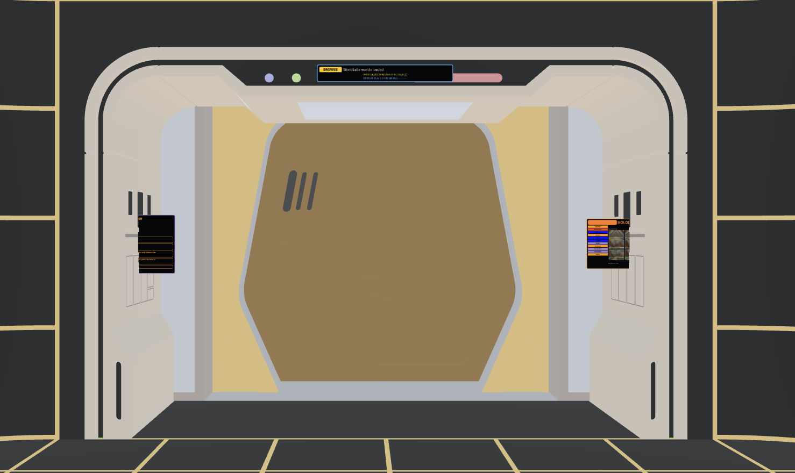
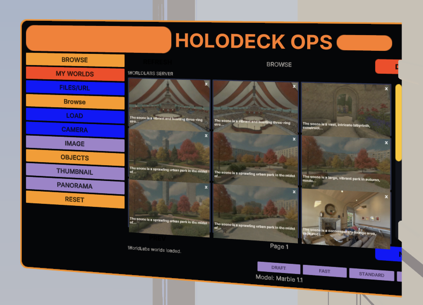

# Headset Holodeck Web


Headset Holodeck Web is a parallel WebXR port of the Unity-based
`HeadsetHolodeckDev` prototype. The goal is to bring the same voice-driven
holodeck experience to headset browsers using Meta's Immersive Web SDK,
Three.js, Spark Gaussian splat rendering, OpenAI transcription, and World Labs
world generation.

The Unity project remains the reference implementation for visual composition,
interaction design, and feature parity. This repository is the WebXR runtime
where we are rebuilding that experience in a local-first, browser-native stack.

## Preview





## Vision

The intended experience is simple:

1. Enter a WebXR holodeck from a headset browser.
2. Use voice to generate or browse immersive worlds.
3. Render those worlds as panoramas or Gaussian splats.
4. Use LCARS-style spatial panels anchored to the holodeck arch.
5. Modify, scale, move, rotate, hide, and reset generated worlds through voice,
   controller, keyboard, and spatial UI controls.

Longer term, the WebXR app should approach parity with the Unity app while
leaning into what the browser is good at: fast iteration, shareable URLs,
local-first development, and deployment to ordinary web hosting.

## Current Features

- **Meta IWSDK WebXR runtime**
  - Built on `@iwsdk/core` with HTTPS Vite development.
  - Works in desktop browser development and headset browser testing.
  - Includes IWSDK development tooling and local-network activation.

- **Unity-exported static holodeck**
  - Loads the exported holodeck shell and arch GLB.
  - Preserves static shell placement and panel anchors from the Unity reference.
  - Keeps the arch visible while generated worlds can be shown or hidden.

- **LCARS-style spatial UI**
  - UIKitML panels for Ops, Info, and Status.
  - Panels are positioned on the arch using exported anchors.
  - World Labs browser is embedded into the Ops panel.

- **World Labs integration**
  - Voice-to-world generation through a local Fastify API server.
  - Background job polling with progress state.
  - World Labs world browser with thumbnails, pagination, load, and delete
    confirmation.
  - Cached SPZ download support for generated worlds.

- **Rendering**
  - Spark-based `.spz` Gaussian splat rendering.
  - Panorama fallback renderer.
  - Local `.spz` loading from server URLs and browser file selection.
  - Static shell hides when generated splats load and returns when worlds unload.

- **Voice and input**
  - Browser microphone capture using `MediaRecorder`.
  - OpenAI transcription through the local API server.
  - XR B-button and keyboard `B` push-to-talk.
  - Local voice commands for generated world transforms:
    - `move world up four meters`
    - `move world down three feet`
    - `rotate world ninety degrees`
    - `rotate world 90 degrees on Z axis`
    - `make the world five times larger`
    - `end program`
  - Unit normalization to meters/radians while preserving the user's spoken
    phrasing in status messages.

- **Navigation**
  - WASD movement with camera-relative direction.
  - `E` / `C` vertical movement.
  - Left/right arrow yaw rotation.
  - Shift speed multiplier.

## Planned Work

- Bring more Unity app workflows into WebXR:
  - richer Ops, Info, and Status panel parity
  - voice command coverage for shell/arch visibility
  - object creation and object modification
  - more complete generated-world lifecycle management

- Improve generated world manipulation:
  - persistent transform state per world
  - reset transform / recenter world commands
  - controller-based grab/scale/rotate interactions
  - better Spark-specific transform controls

- Expand headset-native interaction:
  - hand tracking and direct spatial UI interaction
  - controller bindings beyond B-button push-to-talk
  - passthrough and scene-understanding experiments
  - headset-friendly auth and account setup flows

- Productionize deployment:
  - hosted API proxy strategy
  - user-provided OpenAI / World Labs credentials
  - secure token handling
  - static web hosting build artifacts

- Media and documentation:
  - curated headset screenshots
  - short capture videos of voice-to-world generation
  - demo clips for local splat loading and voice transforms

## Repository Layout

```text
HeadsetHolodeckWeb/
  apps/
    web/        WebXR frontend: IWSDK, Three.js, UIKitML, Spark renderer
    server/     Local API server: OpenAI transcription, World Labs proxy/cache
  assets/       Shared project assets
  docs/         Design notes, milestone plans, export documentation
  test-assets/  Test media such as recorded voice prompts
```

Useful documents:

- [IWSDK capability audit](docs/iwsdk-audit/2026-07-03-capability-audit.md)
- [Unity static shell export notes](docs/export/unity-static-shell-export.md)
- [Holodeck shell export milestone](docs/superpowers/specs/2026-07-03-holodeck-shell-export-design.md)
- [Panel UI parity design](docs/superpowers/specs/2026-07-04-panel-ui-parity-design.md)
- [World Labs browser controls design](docs/superpowers/specs/2026-07-05-worldlabs-browser-controls-design.md)

## Requirements

- Node.js compatible with the web app engines:
  - `>=20.19.0 <21`
  - or `>=22.12.0 <23`
  - or `>=24`
- npm
- A browser that supports WebXR development
- For headset testing, a headset browser on the same local network
- OpenAI API key for transcription
- World Labs API key for world generation and world browsing

## Configuration

Create a `.env` file in the repository root:

```bash
OPENAI_API_KEY=your_openai_api_key
WORLDLABS_API_KEY=your_worldlabs_api_key
PORT=4817
```

`PORT` is optional. The server defaults to `4817`.

The frontend uses same-origin API paths in development and Vite proxies them to
the local API server. This lets a headset browser load one HTTPS URL while the
API still runs locally.

## Install

```bash
npm install
```

## Run Locally

Start the API server:

```bash
npm run dev:server
```

Start the WebXR frontend in another terminal:

```bash
npm run dev:web
```

The frontend prints local and network HTTPS URLs, for example:

```text
Local:   https://localhost:8081/
Network: https://192.168.1.214:8081/
```

Use the network URL from a headset browser on the same network.

## Common Workflows

### Generate a World by Voice

1. Open the app.
2. Press and hold the XR controller B button, or hold the keyboard `B` key.
3. Speak a world prompt.
4. Release the button/key.

If the transcript is a local command, the app executes it immediately. If not,
the transcript is sent to World Labs as a generation prompt.

Example generation prompt:

```text
a large park in autumn, with paths, park benches, trees, bushes, a pond, blue sky with clouds, and tall buildings around it
```

### Modify the Current World by Voice

Examples:

```text
move world up four meters
move world down three feet
rotate world ninety degrees
rotate world 90 degrees on Z axis
make the world twice as big
make the world five times larger
end program
```

`end program` hides the generated world and restores the static holodeck shell.

### Load a Local Splat

The app supports local SPZ URLs through the `localSplat` query parameter:

```text
https://localhost:8081/?localSplat=f382fe75-1925-413f-8b42-fff44f13c57b/full_res.spz
```

The path resolves through the local server's generated-world cache.

### Debug Voice Commands Without the Microphone

In the browser console:

```js
window.holodeckDebug?.executeVoiceCommand?.("move world up four meters")
window.holodeckDebug?.executeVoiceCommand?.("end program")
```

The returned object includes before/after transform snapshots.

## Test

Run all workspace tests:

```bash
npm test
```

Run focused web tests:

```bash
npm run test --workspace apps/web -- voiceCommand xrPushToTalk
```

Run focused server tests:

```bash
npm run test --workspace apps/server -- voiceToWorld
```

Type-check all workspaces:

```bash
npm run typecheck
```

Build the frontend:

```bash
npm run build --workspace apps/web
```

## Deployment Notes

The web frontend is a static Vite app after build, but the full experience also
needs a backend API for:

- OpenAI transcription
- World Labs world generation
- World Labs world browsing/deletion
- generated SPZ cache downloads

For local development, the API runs on this machine and the frontend proxies to
it. For hosted deployments, deploy the static frontend and provide an HTTPS API
service with secure credential handling. Do not expose provider API keys in the
browser.

## Media

The repo includes the exported holodeck shell, WebXR branding assets, and
current milestone screenshots under `docs/media/`.

Planned captures:

- generated splat loaded in the holodeck
- voice command transform demo
- `end program` returning from generated world to static shell

## Relationship to `HeadsetHolodeckDev`

`HeadsetHolodeckDev` remains the Unity reference project. This web project uses
that app as the source of truth for:

- visual placement
- LCARS layout direction
- static shell and arch assets
- interaction patterns
- voice-to-world product behavior

The web app is not a line-by-line Unity rewrite. It is a parallel implementation
that borrows the architecture, workflows, and visual language while adopting
browser-native systems where they make sense.

## Status

This is active prototype work. The app is already useful for local WebXR
experiments, World Labs browsing/loading, splat rendering, and voice command
iteration, but it is not yet production hardened.
